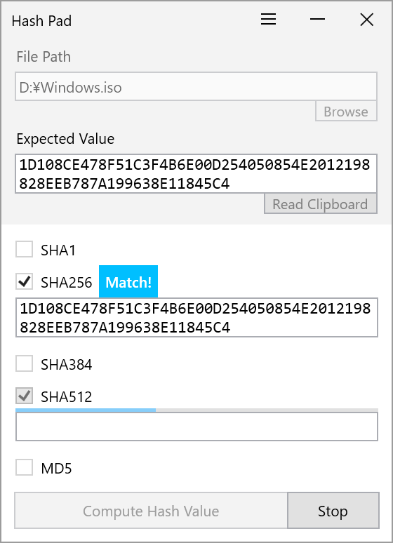

# Hash Pad

Hash Pad is a simple tool to compute and compare hash value including from Explorer's context menu. It is designed to complete this task in the minimum steps. SHA1, SHA256, SHA384, SHA512 and MD5 are supported.

 
(DPI: 175%)

Additonal languages:

 + ja-JP by @emoacht
 + zh-CN by @nkh0472
 + zh-TW by @nkh0472

## Requirements

 * Windows 10
 * .NET 5.0

## Download

[Hash Pad](https://www.microsoft.com/store/apps/9nrdj8214gbt) (Microsoft Store)

## Usage

 - To send a file to be compared from `Send to` of Explorer's context menu, open the menu by tapping hamburger button and check `Add to 'Send to' of Explorer's context menu`. Or drag and drop a file to the window. Or  select a file from file dialog.
 - Paste a string of expected value in `Expected Value`. Or read it directly from clipboard.
 - If the computed hash value matches the expected value, `Match` message will appear.

## Remarks

 - Before uninstalling, if you checked `Add to 'Send to' of Explorer's context menu`, uncheck it to remove the shortcut in `Send to` folder. If you choose to remove it manually, type `shell:SendTo` in address bar of Explorer to open that folder.

## History

Ver 2.4 2020-12-17

- Migrate to .NET 5.0

Ver 2.3 2020-12-10

- Fix bugs

Ver 2.2 2020-12-9

- Adjust location when called from Explorer's context menu

Ver 2.1 2020-11-27

- Add ja-JP, zh-CN, zh-TW languages. Thanks to @nkh0472!
- Change to remember folder path
- Change to remove spaces from expected value

Ver 2.0 2020-11-20

- Redesign and improve usability

## License

 - MIT License
